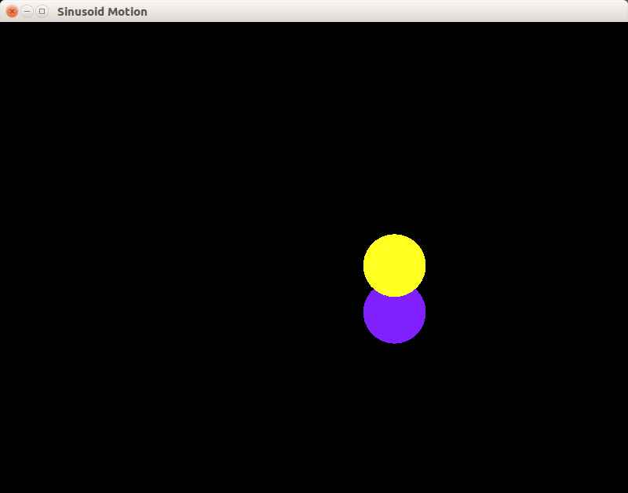

## Пример 05: два шарика движутся по синусоиде.

Создаётся окно, в котором находятся два шарика. Они движутся по синусоиде, временами их траектории пересекаются. Они ничем не ограничены и вылетают за пределы окна.

