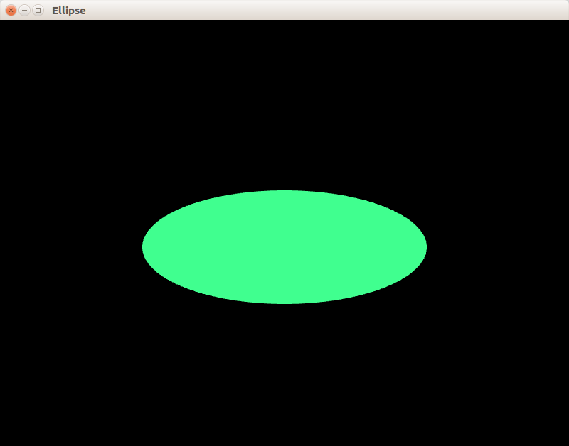

## Пример 06: эллипс

Создаётся окно, в котором нарисован эллипс. Эллипс рисуется как многоугольник, имеющий 200 вершин. Координаты вершин расчитываются с помощью тригонометрии и линейной алгебры. Края эллипса сглажены благодаря настройкам графического контекста `sf::ContextSettings`.

