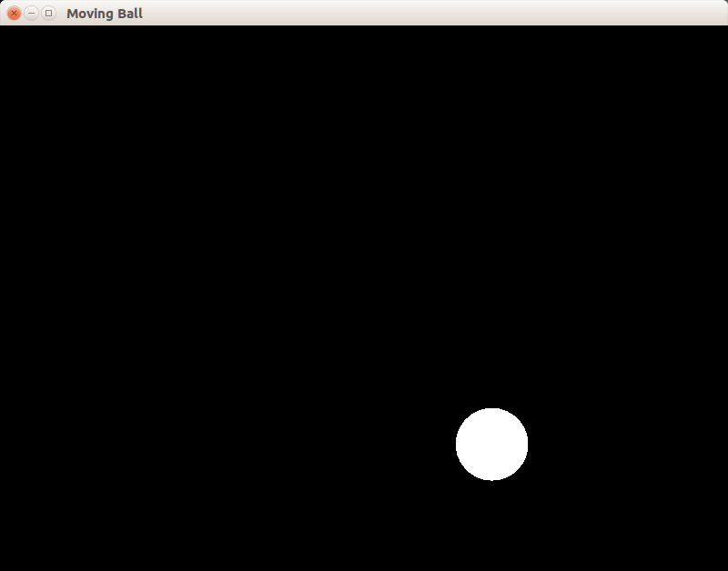

## Пример 07: отскакивающий от стенок шарик

Создаётся окно, в котором находится движущийся шарик. Он не может вылететь за пределы окна. Количество кадров в секунду искусственно ограничено до 60 (но может быть и меньше, если компьютер не успевает).

>Вы можете реализовать ограничение ещё проще: используйте метод [sf::Window::setFramerateLimit](https://www.sfml-dev.org/documentation/2.4.2/classsf_1_1Window.php#af4322d315baf93405bf0d5087ad5e784).

