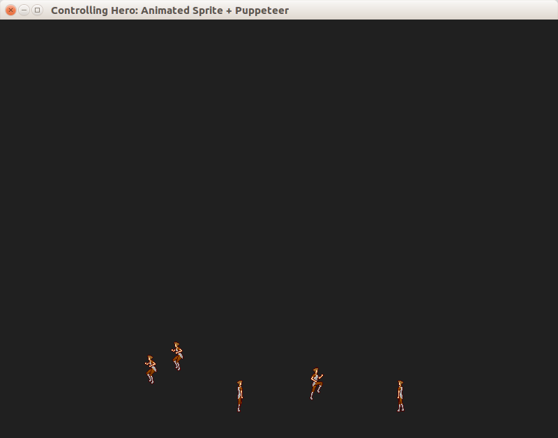
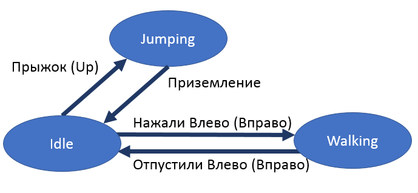

## Пример 09: анимация персонажа

Создаётся окно, в котором находится крошечный персонаж. Персонаж управляется вклавишами-стрелками Влево, Вправо, Вверх. Под управлением пользователя персонаж может стоять, идти либо прыгать:

### Реализация состояний

### Анимация

Спрайты персонажа взяты с ресурса [opengameart.org](https://opengameart.org/content/mv-platformer-male-32x64). Все кадры покадровой анимации были сложены в одном изображение (этот подход называется "текстурный атлас"). Для упаковки использована модификация [Cheetah Texture Packer](https://github.com/ps-group/Cheetah-Texture-Packer-2).

